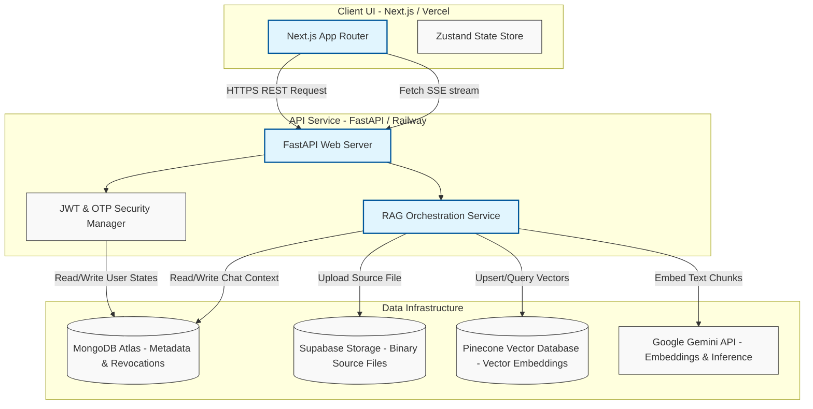
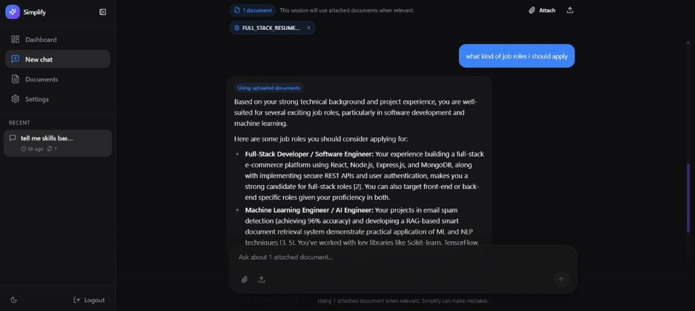
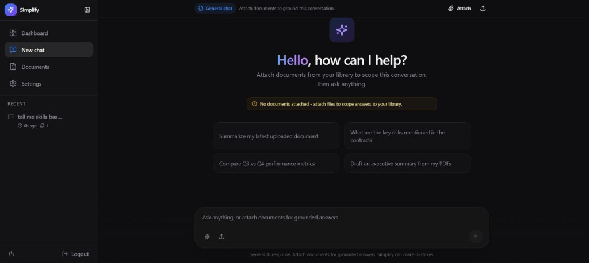
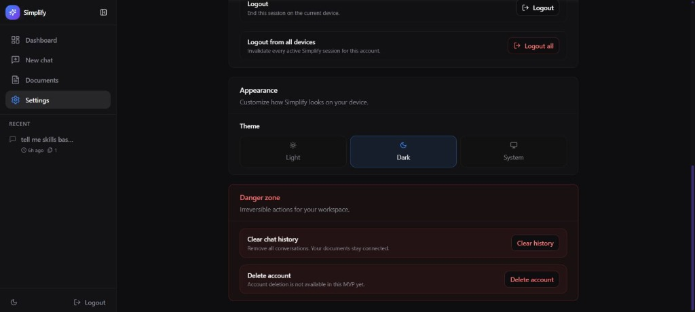

# Simplify AI

[](https://github.com/joel8779/simplify-ai/actions/workflows/ci.yml)
[](https://github.com/joel8779/simplify-ai/commits/main)


> **Full-Stack SaaS RAG Platform** — Secure document retrieval, conversational QA, and semantic search.

[](https://simplify-ai-lilac.vercel.app/)
[](https://nextjs.org/)
[](https://fastapi.tiangolo.com/)
[](https://www.mongodb.com/atlas)
[](https://www.pinecone.io/)
[](https://supabase.com/storage)
[](LICENSE)

---

## 📌 Overview

**Simplify AI** is a decoupled full-stack application that provides users with secure workspaces to upload, index, and query private documents (PDF, DOCX, TXT, MD). The system generates vector embeddings, stores them in a spatial index, and uses grounded prompts to stream contextual answers with page-level citations in real time.

---

## ⚡ Live Deployments

*   **Production Web App**: [https://simplify-ai-lilac.vercel.app/](https://simplify-ai-lilac.vercel.app/)
*   **API Health Endpoint**: `https://saas-rag-production.up.railway.app/api/v1/health` (FastAPI backend deployed on Railway)

---

## ⚠️ The Problem

Many Retrieval-Augmented Generation (RAG) tools are built as monolithic scripts or generic wrappers around API endpoints. These designs suffer from:
1.  **Gateway Timeouts**: Blocking API threads while parsing large documents or creating hundreds of embeddings.
2.  **Weak Security**: Hardcoded single-token structures that risk session hijacking if tokens are stolen.
3.  **High Latency**: Waiting for complete LLM inference blocks to finish before returning responses to the user.
4.  **No Contextual Grounding**: Generating generic replies that lack verifiable references, leading to AI hallucinations.

---

## 💡 The Solution

Simplify AI addresses these issues using a production-adjacent, decoupled architecture:
*   **Asynchronous Processing**: Immediate API responses with `processing` flags, delegating extraction and embedding tasks to background execution queues.
*   **Multi-Stage Auth Rotation**: Short-lived JWT access tokens paired with long-lived rotated refresh tokens and revocation lists.
*   **Low-Latency Stream Injection**: Progressive token delivery using Server-Sent Events (SSE) and native browser streams.
*   **Grounded Verification**: A citation metadata pipeline that links every generated block to verified source page numbers and text excerpts.

---

## ✨ Features

*   **SaaS-Ready Security**: Email verification via SMTP One-Time Passwords (OTP), and JWT access/refresh token rotation with signature-based MongoDB revocation.
*   **Multi-Format Parsing**: Automatic structure detection and content extraction for `.pdf`, `.docx`, `.txt`, and `.md` files.
*   **Semantic Vector Indexes**: Chunks parsed text using character-overlapping splitters, converts chunks to 3072-dimensional embeddings via Gemini, and indexes them in Pinecone namespaces.
*   **SSE Token Streaming**: Pushes generator-driven chunk deltas from FastAPI to Next.js using `StreamingResponse` and fetches browser-side stream readers.
*   **Grounded Citations**: Maps similarity search nodes back to database-backed chunk excerpts, rendering clickable citation cards.
*   **Responsive Dark Mode**: Minimalist interface built on Tailwind CSS, Radix UI primitives, and state managed by Zustand.

---

## 🏗️ Architecture



---

## 🧬 RAG Pipeline Flow

```
[ Upload File ]
       │
       ▼
[ Extension & Size Validation ]
       │
       ▼
[ Upload Binary to Supabase Storage ]
       │
       ▼
[ Parse Extract Text (pypdf/docx) ]
       │
       ▼
[ LangChain Text Chunking ] (800 chars, 200 overlap)
       │
       ▼
[ Gemini 3072-D Embeddings ] (gemini-embedding-001)
       │
       ▼
┌──────┴──────────────────────────┐
│                                 ▼
▼                         [ Upsert to Pinecone ]
[ Store Text Excerpts & Metadata ]  (Namespace isolation)
(MongoDB Atlas mappings)
```

1.  **Ingest & Validate**: The client posts a file. The backend checks format restrictions and enforces a `25MB` ceiling.
2.  **Persist Source**: The raw binary is uploaded to Supabase Storage, segregating database records from raw binaries.
3.  **Extract & Segment**: A background worker parses text, creating overlapping segments via character-based splitters to maintain cross-chunk context.
4.  **Vector Generation**: Text segments are sent to `models/gemini-embedding-001` to generate dense vector indices.
5.  **Index & Database Mappings**:
    *   Embeddings are upserted into Pinecone within the user's isolated namespace.
    *   Excerpts, page numbers, offsets, and document links are indexed in MongoDB Atlas.
6.  **Semantic Similarity Retrieval**: When a query is received, the backend generates an embedding of the query, retrieves the top $k=8$ matching nodes from Pinecone, and reads the original text chunks from MongoDB.
7.  **Grounded Generation**: The server feeds the retrieved context and system instructions into `gemini-2.5-flash`, forcing it to respond *only* with the provided context.
8.  **SSE Streams**: FastAPI streams delta chunks to the client, while Next.js parses the tokens, rendering interactive citation cards matching the source excerpts.

---

## 📸 Screenshots

<table>
  <tr>
    <td align="center"><b>Document Library</b></td>
    <td align="center"><b>Conversational RAG Panel</b></td>
  </tr>
  <tr>
    <td></td>
    <td></td>
  </tr>
  <tr>
    <td colspan="2" align="center"><b>Workspace Settings (SaaS Verification)</b></td>
  </tr>
  <tr>
    <td colspan="2" align="center"></td>
  </tr>
</table>

---

## 🛠️ Tech Stack

| Layer | Technology | Role |
| :--- | :--- | :--- |
| **Frontend UI** | Next.js 15, React 19, TypeScript, Tailwind CSS | App Router client layout; state stores managed by Zustand. |
| **Backend API** | FastAPI 0.115, Python 3.11+, Uvicorn | Async route handlers, validation schemas (Pydantic v2). |
| **Database** | MongoDB Atlas (via `motor` driver) | Mappings, chat logs, user schemas, and token denylists. |
| **Vector DB** | Pinecone | Dense vector indexes and namespace queries. |
| **Storage** | Supabase Storage | Secure bucket hosting for raw binaries. |
| **AI Models** | Google Gemini API | `gemini-2.5-flash` (inference), `gemini-embedding-001` (embeddings). |
| **Mail** | SMTP Service | User signup and email OTP delivery. |

---

## 🚀 Local Setup

### Prerequisites
*   Node.js 22+
*   Python 3.11+
*   MongoDB, Pinecone, Supabase, and Google Gemini API keys.

### 1. Backend Setup
1. Navigate to the `backend/` directory:
   ```bash
   cd backend
   ```
2. Create and activate a Python virtual environment:
   ```bash
   python -m venv .venv
   # Windows:
   .venv\Scripts\activate
   # macOS/Linux:
   source .venv/bin/activate
   ```
3. Install dependencies:
   ```bash
   pip install -r requirements.txt
   ```
4. Copy the environment variables template and configure it:
   ```bash
   cp .env.example .env
   # Edit .env with your private credentials
   ```
5. Run the web server:
   ```bash
   uvicorn app.main:app --reload --host 0.0.0.0 --port 8000
   ```

### 2. Frontend Setup
1. Navigate to the `frontend/` directory:
   ```bash
   cd ../frontend
   ```
2. Install package dependencies:
   ```bash
   npm install
   ```
3. Copy environment configurations:
   ```bash
   cp .env.example .env.local
   # Edit with Next.js configurations
   ```
4. Start the Next.js development server:
   ```bash
   npm run dev
   ```
5. Open your browser and navigate to `http://localhost:3000`.

---

## 📋 Environment Variables

### Backend Setup (`backend/.env`)
```env
APP_ENV=development
DEBUG=true
API_V1_PREFIX=/api/v1
CORS_ORIGINS=http://localhost:3000

# Relational & NoSQL Metadata
MONGODB_URI=mongodb+srv://...
MONGODB_DB_NAME=simplify

# Vector Configurations
VECTOR_STORE_PROVIDER=pinecone
PINECONE_API_KEY=your-pinecone-key
PINECONE_INDEX_NAME=simplify-documents
PINECONE_NAMESPACE=simplify
PINECONE_DIMENSION=3072

# Storage & AI Mappings
SUPABASE_URL=https://your-project.supabase.co
SUPABASE_SERVICE_KEY=your-service-role-key
SUPABASE_BUCKET=documents
GEMINI_API_KEY=your-gemini-key
GEMINI_CHAT_MODEL=models/gemini-2.5-flash
GEMINI_EMBEDDING_MODEL=models/gemini-embedding-001

# Security & Mail
JWT_SECRET_KEY=generate-a-strong-random-key
JWT_ALGORITHM=HS256
ACCESS_TOKEN_EXPIRE_MINUTES=30
REFRESH_TOKEN_EXPIRE_DAYS=7
SMTP_HOST=smtp.gmail.com
SMTP_PORT=587
SMTP_USERNAME=your-email@gmail.com
SMTP_PASSWORD=your-app-password
SMTP_FROM_EMAIL=no-reply@simplify.ai
SMTP_FROM_NAME="Simplify AI"
```

### Frontend Setup (`frontend/.env.local`)
```env
NEXT_PUBLIC_API_URL=http://127.0.0.1:8000
NEXT_PUBLIC_MAX_DOCUMENTS_PER_CHAT=8
```

---

## 📁 Project Structure

```
simplify-ai/
├── backend/
│   ├── app/
│   │   ├── api/             # REST routing entry points
│   │   ├── core/            # Configs, authorization middlewares
│   │   ├── db/              # MongoDB clients, session setups
│   │   ├── models/          # Data schemas and entities
│   │   ├── repositories/    # Database abstraction queries
│   │   ├── services/        # RAG pipeline, parsing, JWT managers
│   │   └── main.py          # FastAPI application initialization
│   ├── requirements.txt
│   └── Dockerfile
└── frontend/
    ├── app/                 # Next.js App Router (Layouts/Routes)
    ├── components/          # Reusable Radix UI & Citation widgets
    ├── lib/                 # Auth context, state store (Zustand), API fetchers
    ├── package.json
    └── tailwind.config.ts
```

---

## 🔑 Engineering Decisions

### 1. Multi-Stage Token Rotation
*   **Problem**: In single-token API designs, if a client-side JWT is stolen, malicious actors gain indefinite system access.
*   **Solution**: Implemented access/refresh token rotation. Access tokens are short-lived (`30 minutes`), while refresh tokens exist for `7 days` and are rotated upon every validation cycle.
*   **Security Enforcement**: When a user logs out, the access token signature is cached in MongoDB under a denylist collection with a TTL index matching its expiration timestamp. This prevents session hijack attempts using discarded tokens.

### 2. Segregation of Data Boundaries
*   To keep database operations fast, datastores are segregated based on operational tasks:
    *   **Supabase Storage** hosts the heavy raw binary files (PDFs, DOCX).
    *   **Pinecone** is used exclusively for vector similarity search, preventing CPU-intensive calculations on relational or document servers.
    *   **MongoDB Atlas** stores metadata references and text chunks, facilitating high-speed citation retrieval.

---

## 🔒 Security Specifications

*   **Role-Based Access Control (RBAC)**: Custom middlewares check token scopes, enforcing document deletions to administrative roles.
*   **Secure Cookies**: Auth tokens are transferred via HttpOnly, Secure, and SameSite cookies, shielding the application from XSS vector vulnerabilities.
*   **Email Verification**: Standard SMTP routing requires new signups to verify email ownership via dynamic OTP codes before profiles are activated.

---

## ⚡ Performance Tuning

*   **Background Tasks**: Document chunking and embedding pipelines run on FastAPI's `BackgroundTasks`, releasing the API request thread immediately.
*   **Low-Level Stream Buffering**: Uses Next.js streams to output token deltas to UI elements without triggering full React page re-renders.
*   **Isolated Namespacing**: Pinecone vector queries are filtered by user namespaces, reducing retrieval search space and increasing query throughput.

---

## 🔮 Future Improvements

1.  **Celery + Redis Worker Pools**: Offload document calculations to isolated distributed worker processes.
2.  **Redis Cache Integration**: Migrate JWT denylists to an in-memory Redis node to achieve sub-millisecond lookup times during API authorization.
3.  **Stripe Billing Integration**: Implement credit quotas and subscription management to enforce usage limits.

---

## 🤝 Contributing

Contributions are welcome. Please open an issue first to discuss changes before submitting a pull request.

1. Fork the Repository.
2. Create a branch (`git checkout -b feature/improvement`).
3. Commit your changes (`git commit -m 'feat: description'`).
4. Push to your branch (`git push origin feature/improvement`).
5. Open a Pull Request.

---

## 📄 License

MIT License — see [LICENSE](LICENSE) for details.
