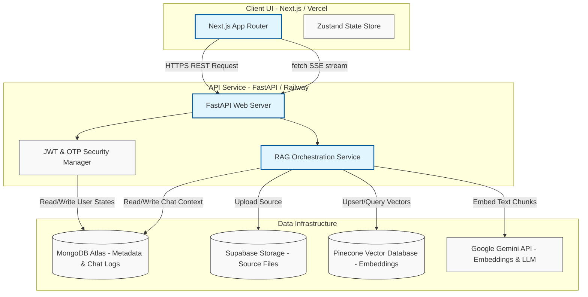

# Simplify AI

> A full-stack SaaS RAG platform for secure document retrieval and conversational QA.

[](https://nextjs.org/)
[](https://fastapi.tiangolo.com/)
[](https://www.mongodb.com/atlas)
[](https://www.pinecone.io/)
[](https://supabase.com/storage)
[](https://ai.google.dev/)
[](LICENSE)

Simplify AI is a full-stack SaaS RAG (Retrieval-Augmented Generation) application designed for private document retrieval and interactive QA. It provides users with a secure workspace to upload multi-format documents (PDF, DOCX, TXT, MD), index them into a similarity vector store, and conduct natural-language queries that stream grounded answers complete with precise page-level citations.

The project is architected as a decoupled system: a Next.js (App Router) client dashboard hosted on Vercel, a Python FastAPI backend deployed on Railway, MongoDB Atlas for operational application metadata, Supabase Storage for secure file hosting, Pinecone for index retrieval, and Google's Gemini models for embedding and inference generation.

---

## System Architecture

The interaction and data-flow model between the decoupled service boundaries is structured below:



---

## RAG Pipeline

Simplify AI processes and queries documents through a multi-stage RAG execution pipeline:

1.  **File Ingestion & Validation**: The user uploads a document through the frontend dashboard. The backend validates the extension (`.pdf`, `.docx`, `.txt`, `.md`) and enforces a file size limit (default `25MB`).
2.  **Object Storage**: The validated file is uploaded to a private Supabase Storage bucket. This isolates raw binary assets from database storage.
3.  **Parsing & Chunking**: Text is extracted from the document using customized parsers and chunked into overlapping segments (default `800` characters with a `200` character overlap) using LangChain text splitters to maintain semantic coherence.
4.  **Embedding Generation**: The text chunks are passed to the Gemini embedding API (`models/gemini-embedding-001`) to generate `3072`-dimensional dense vector representations.
5.  **Vector Store & Metadata Mapping**:
    *   The `3072`-dimension embeddings are upserted to Pinecone under a unique workspace namespace.
    *   The text chunks, document relationship mapping, page numbers, and relative offsets are stored in MongoDB Atlas to support quick citation reconstructions.
6.  **Semantic Search (Retrieval)**: When the user asks a question, the backend embeds the query using Gemini and searches Pinecone for the top `8` contextually similar chunks.
7.  **Answer Generation (Grounded Prompting)**: The retrieved chunks are formatted into a grounded system prompt. The model is instructed to answer the user's question *only* using the provided text blocks, returning references when matching data points.
8.  **Server-Sent Event Streaming**: The FastAPI backend streams the response back to the client using a Chunked Transfer response. The frontend reads the stream progressively using the browser's `ReadableStream` API, displaying tokens in real time alongside responsive citation cards.

---

## Features

*   **SaaS-Grade Security**: Short-lived JWT access tokens with long-lived refresh token rotation, global logout access-token denylisting, and secure email OTP verification during registration.
*   **Persistent Conversations**: Full database-backed chat histories featuring session renaming, soft deletions, and responsive loading.
*   **Detailed Citations**: Interactive citation cards linked to streamed answers, detailing matching excerpt text, page numbers, and source document metadata.
*   **Hybrid Chat Fallback**: Contextual RAG routing that defaults to a standard general assistant prompt if Pinecone similarity scoring returns no relevant document matches.
*   **Dashboard Analytics**: Live data widgets tracking total document pages, uploaded files size, and message history metrics.
*   **Sleek Dark Mode Theme**: Minimalist, responsive UI built with Tailwind CSS, Next.js components, and state synchronization via Zustand.

---

## System Screens (Placeholders)

### 1. Document Upload Library
> *Placeholder: Capture a screenshot of the main file library page displaying the drag-and-drop file uploader and the list of processed, indexed documents.*

### 2. Conversational QA Panel (Streaming & Citations)
> *Placeholder: Capture a screenshot of the chat workspace showing a streamed answer, highlighting the citation cards containing document page numbers and text excerpts.*

### 3. Dashboard Analytics UI
> *Placeholder: Capture a screenshot of the analytics overview dashboard displaying total documents, chat histories, and usage charts.*

---

## Tech Stack

| Layer | Technologies | Description |
| :--- | :--- | :--- |
| **Frontend UI** | Next.js 14, React 18, TypeScript, Tailwind CSS | App Router client layout with state stores managed by Zustand. |
| **Backend API** | FastAPI, Python 3.11+, Uvicorn | Web API service utilizing async handlers and Pydantic validators. |
| **Database** | MongoDB Atlas (via `motor`) | Document storage holding users, chat logs, and chunk text metadata. |
| **Vector DB** | Pinecone | Index storing high-dimensional embeddings for cosine similarity lookups. |
| **Object Storage**| Supabase Storage | S3-compatible cloud storage hosting raw PDF and word document files. |
| **AI Models** | Google Gemini API | `gemini-2.5-flash` for inference; `gemini-embedding-001` for vectors. |
| **Mail Delivery** | SMTP Service | Handles registration verification OTPs. |

---

## Local Setup

### Prerequisites
*   Node.js 20+ installed.
*   Python 3.11+ installed.
*   Access keys for MongoDB Atlas, Pinecone, Supabase, and Google Gemini.

### 1. Backend Service Configuration
1. Navigate to the `backend/` directory:
   ```bash
   cd backend
   ```
2. Create and activate a Python virtual environment:
   ```bash
   python -m venv .venv
   # Windows (PowerShell):
   .venv\Scripts\activate
   # Linux/macOS:
   source .venv/bin/activate
   ```
3. Install the required dependencies:
   ```bash
   pip install -r requirements.txt
   ```
4. Copy the environment variables template and configure it:
   ```bash
   cp .env.example .env
   ```
5. Set the required variables in `.env` (refer to the Environment Variables section below).
6. Start the development server:
   ```bash
   uvicorn app.main:app --reload --host 0.0.0.0 --port 8000
   ```
7. Verify the service is running by navigating to `http://127.0.0.1:8000/api/v1/health`.

### 2. Frontend Interface Configuration
1. Navigate to the `frontend/` directory:
   ```bash
   cd ../frontend
   ```
2. Install package dependencies:
   ```bash
   npm install
   ```
3. Copy the environment variables template:
   ```bash
   cp .env.example .env.local
   ```
4. Start the local Next.js server:
   ```bash
   npm run dev
   ```
5. Open your browser and navigate to `http://localhost:3000`.

---

## Environment Variables

### Backend (`backend/.env`)
```env
APP_ENV=development
DEBUG=true
API_V1_PREFIX=/api/v1
CORS_ORIGINS=http://localhost:3000

# Databases & Vector Stores
MONGODB_URI=mongodb+srv://...
MONGODB_DB_NAME=simplify
VECTOR_STORE_PROVIDER=pinecone
PINECONE_API_KEY=your-pinecone-key
PINECONE_INDEX_NAME=simplify-documents
PINECONE_NAMESPACE=simplify
PINECONE_DIMENSION=3072

# Storage & AI
SUPABASE_URL=https://your-supabase-project.supabase.co
SUPABASE_SERVICE_KEY=your-supabase-service-role-key
SUPABASE_BUCKET=documents
GEMINI_API_KEY=your-gemini-key
GEMINI_CHAT_MODEL=models/gemini-2.5-flash
GEMINI_EMBEDDING_MODEL=models/gemini-embedding-001

# Security & Verification
JWT_SECRET_KEY=generate-a-strong-random-key
JWT_ALGORITHM=HS256
ACCESS_TOKEN_EXPIRE_MINUTES=30
REFRESH_TOKEN_EXPIRE_DAYS=7
SMTP_HOST=smtp.gmail.com
SMTP_PORT=587
SMTP_USERNAME=your-email@gmail.com
SMTP_PASSWORD=your-app-password
SMTP_FROM_EMAIL=no-reply@simplify.ai
SMTP_FROM_NAME="Simplify AI"
```

### Frontend (`frontend/.env.local`)
```env
NEXT_PUBLIC_API_URL=http://127.0.0.1:8000
NEXT_PUBLIC_MAX_DOCUMENTS_PER_CHAT=8
```

---

## API Structure

The backend exposes a structured REST API under the `/api/v1` prefix:

### Authentication
*   `POST /auth/signup`: Initiates registration, creating a pending account and sending an email OTP.
*   `POST /auth/verify-otp`: Validates the signup OTP code and registers the active user profile.
*   `POST /auth/login`: Validates user credentials, returning access and refresh JWT tokens.
*   `POST /auth/refresh`: Processes a refresh token to rotate keys.
*   `POST /auth/logout`: Revokes refresh tokens and adds active access tokens to the denylist database.

### Documents
*   `POST /documents/upload`: Accepts files, writes to Supabase, generates embeddings, and indexes chunks.
*   `GET /documents`: Lists all indexed files with processing statuses.
*   `DELETE /documents/{id}`: Removes the document metadata, storage file, and Pinecone vectors.

### Chat & Generation
*   `POST /chats`: Creates a new persistent chat session.
*   `GET /chats`: Retrieves user chat histories.
*   `POST /chats/{id}/messages`: Streams inference tokens from the RAG orchestrator using fetch readable streams.

---

## Engineering Decisions & Security Designs

### 1. Multi-Stage Token Rotation (SaaS Auth)
*   **Problem**: In single-token API designs, if a client-side JWT is stolen, malicious actors gain indefinite system access.
*   **Solution**: Implemented access/refresh token rotation. Access tokens are short-lived (`30 minutes`), while refresh tokens exist for `7 days` and are rotated upon every validation cycle.
*   **Security Enforcement**: When a user logs out, the access token signature is cached in MongoDB under a denylist collection with a TTL index matching its expiration timestamp. This prevents session hijack attempts using discarded tokens.

### 2. File and Vector Segregation
*   To keep database transactions fast and responsive, database loads are segregated based on operational usage:
    *   **Supabase Storage** hosts the heavy raw binary files (PDFs, DOCX).
    *   **Pinecone** is used exclusively for vector similarity search, preventing CPU-intensive calculations on relational or document servers.
    *   **MongoDB Atlas** stores metadata references and text chunks, facilitating high-speed citation retrieval.

---

## Challenges Solved

### Handling High-Throughput Token Streams
*   **Challenge**: Streaming inference text using traditional REST API endpoints can create latency and memory bloat on client-side requests, especially under connection dropouts.
*   **Solution**: Leveraged FastAPI's `StreamingResponse` to push generator-driven SSE payloads. The Next.js frontend uses low-level `ReadableStream` readers to capture, decode, and append text deltas dynamically to UI elements without page-wide state re-renders.

### Asynchronous In-Memory Ingestion Bottlenecks
*   **Challenge**: Synchronously waiting for Gemini to embed hundreds of document text chunks inside a single HTTP request can cause gateway timeouts.
*   **Solution**: Built a modular background processing task structure in `services/document.py` using Python's standard `BackgroundTasks` client. The API responds immediately with status `processing` upon saving the source file to Supabase, while background processes handle chunking, vector embedding, and Pinecone upserts asynchronously.

---

## Future Roadmap

1.  **Distributed Worker Ingestion**: Transition from basic FastAPI local `BackgroundTasks` to a distributed queue system using Celery and Redis to isolate text parsing and vector calculations.
2.  **Redis Authentication Cache**: Move access-token denylist and OTP storage from MongoDB Atlas to a high-speed Redis cluster to minimize latency on request authentication middleware.
3.  **Payment Integrations**: Implement Stripe billing models with subscription plans to manage maximum document sizes and message volume quotas.
4.  **Hybrid BM25 Vector Search**: Combine Pinecone semantic search results with local sparse BM25 indexing to optimize search retrieval for exact keywords and code segments.

---

## Contributing

Contributions are welcome. Please open an issue first to discuss the features you want to contribute.

1. Fork the Repository.
2. Create a branch (`git checkout -b feature/improvement`).
3. Commit your changes (`git commit -m 'feat: description'`).
4. Push to your branch (`git push origin feature/improvement`).
5. Open a Pull Request.

---

## License

This project is licensed under the MIT License. See the [LICENSE](LICENSE) file for details.
